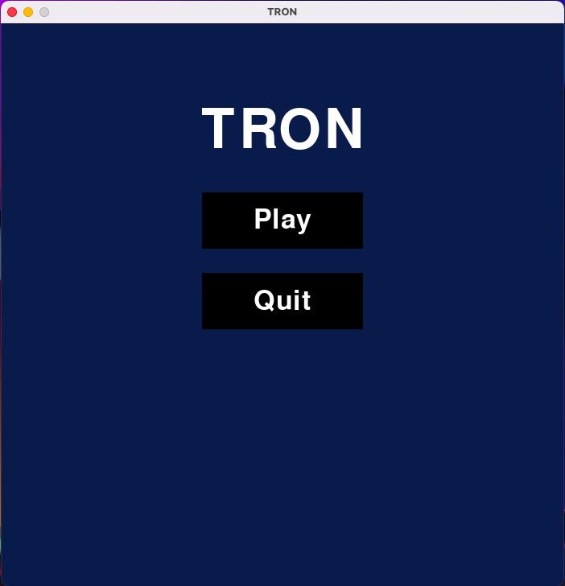
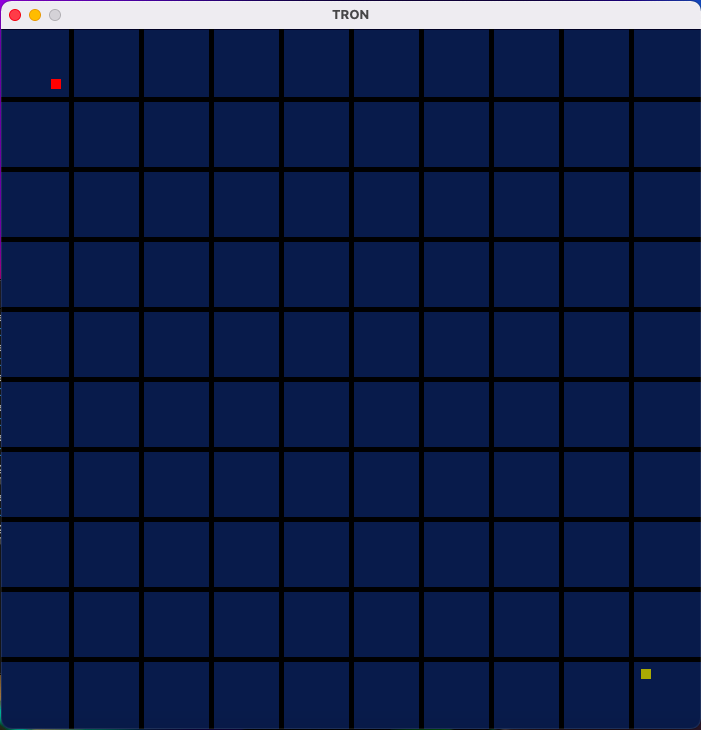
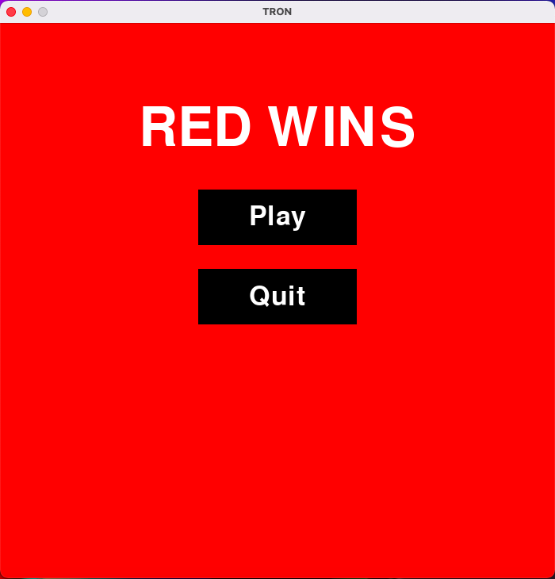
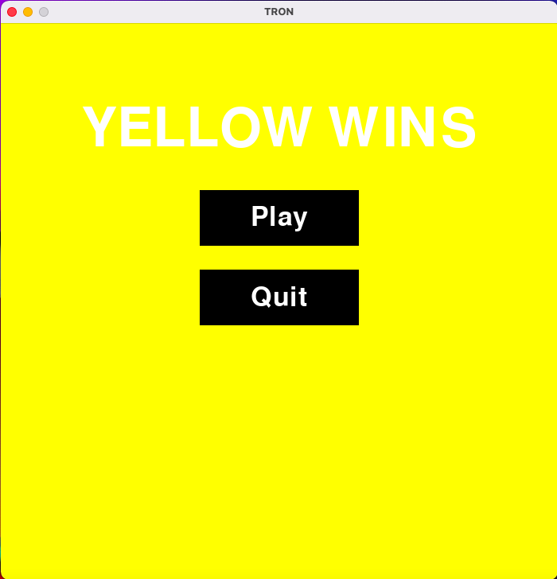

# **Tron**

Tron is a game where you are a vehicle that leaves behind a stele. The objective of the game is to make the other player crash with your stele.

## **Getting started**

### **Prerequisites**
 - Python3
 - Pygame 2.0.1
 - virtualenv

### **Installation**

To clone the project follow the following steps.

1. Open the Terminal
2. Change to the directory you want to copy the proyect
3. Write the following line and press ENTER\
```git clone https://github.com/CodingMike15/tron.git```
4. Change to the directory venv
5. Write the following line and press ENTER to activate the viurtualenv\
```source bin/activate```
6. Once activate the virtualenv change to the directory src
7. Write the following line and press ENTER to run the game\
```python main.py```

## **Preview**

### **Main menu**


### **Game**


### **Red wins screen**


### **Yellow wins screen**
